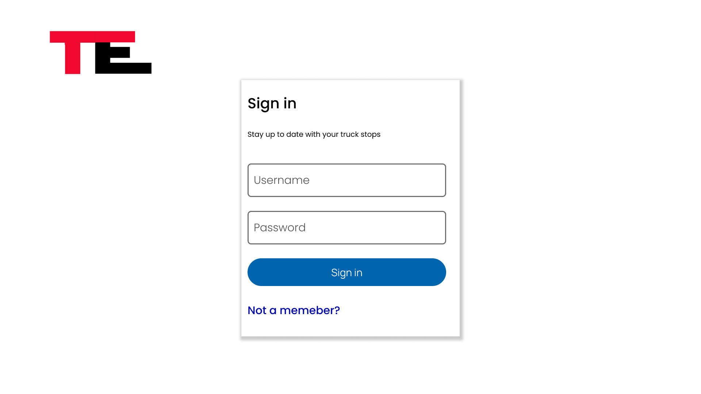

<h1 align="center">Welcome to Tofu Express 👋</h1>
<p>
  
  <a href="https://github.com/git/git-scm.com/blob/main/MIT-LICENSE.txt" target="_blank">
    
  </a>
  <a href="https://twitter.com/Abdifatah Osman" target="_blank">
    
  </a>
</p>

> A website for truckers and dispatchers to post and share truck stops/rest areas
https://github.com/AbdifatahOsman2/TruckerAppv2.git
## Wireframes

### Desktop





## Install

```sh
npm install 
```

## Component Hierarchy


## ERD (Entity Relationship Diagram)


## Author

👤 **Abdifatah Osman**

* Website: (https://abdifatahosman.com)
* Twitter: [@Abdifatah Osman](https://twitter.com/omarosman258)
* Github: [@AbdifatahOsman2](https://github.com/AbdifatahOsman2)
* LinkedIn: [@Abdifatah Osman](https://linkedin.com/in/abdifatahothman)

## Show your support

Give a ⭐️ if this project helped you!

## 📝 License

Copyright © 2022 [Abdifatah Osman](https://github.com/AbdifatahOsman2).<br />
This project is [MIT](https://github.com/git/git-scm.com/blob/main/MIT-LICENSE.txt) licensed.

***
_This README was generated with ❤️ by [readme-md-generator](https://github.com/kefranabg/readme-md-generator)_# TruckerApplication

